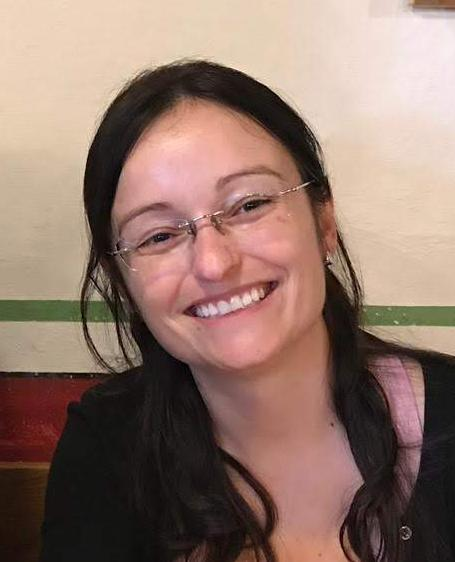

# Equipo

El **CET** reúne investigadores, estudiantes y técnicos de las instituciones de la Red de Genomas Neotropicales.

<!--
  Para agregar a una persona:
  1. Pon la foto (cuadrada, ~400×400 px) en docs/assets/equipo/nombre-apellido.jpg
  2. Copia un bloque "- " y edítalo (aquí y en docs/pt/equipo.md).
  Sin foto, usa :material-account-circle:{ .team-photo-placeholder }
-->

## :material-account-star: Coordinación

- { .team-photo }

    **Renata de Oliveira Dias**

    Coordinadora · Universidade Federal de Goiás (UFG), Brasil

    [:material-school: Lattes](http://lattes.cnpq.br/5189684087836977)

- :material-account-circle:{ .team-photo-placeholder }

    **Nombre Apellido**

    Cargo · Institución, País

    [:material-link-variant: Perfil](#)

## :material-human-male-board: Instructores

- :material-account-circle:{ .team-photo-placeholder }

    **Nombre Apellido**

    Institución, País

    [:material-link-variant: Perfil](#)

- :material-account-circle:{ .team-photo-placeholder }

    **Nombre Apellido**

    Institución, País

    [:material-link-variant: Perfil](#)

- :material-account-circle:{ .team-photo-placeholder }

    **Nombre Apellido**

    Institución, País

    [:material-link-variant: Perfil](#)

## :material-account-group: Monitores y colaboradores

- :material-account-circle:{ .team-photo-placeholder }

    **Nombre Apellido**

    Institución, País

## :material-account-plus: Únete al equipo

¿Te gustaría colaborar como instructor(a), monitor(a) o institución anfitriona? Mira la página [Contribuir](contribuir.md).
