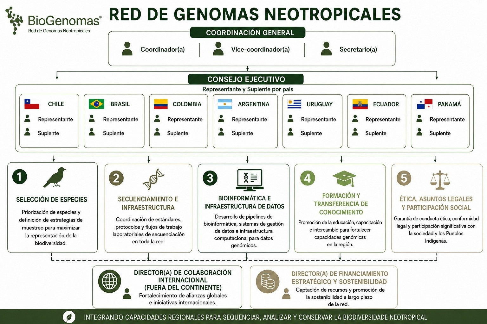

# Sobre o comitê

## :material-earth: A Rede BioGenomas

A **[Rede de Genomas Neotropicais (Rede BioGenomas)](https://www.genotropics.org/neotropical-biogenomes-network)** articula iniciativas nacionais da **Argentina, Brasil, Chile, Colômbia, Equador, Panamá e Uruguai** para gerar, gerenciar, analisar e utilizar **genomas de referência da biodiversidade neotropical**.

A Rede é conduzida por uma **Coordenação Geral** e um **Conselho Executivo**, com um(a) representante e um(a) suplente por país, e organiza seu trabalho científico e técnico em **cinco comitês**:

-   :material-bird:{ .lg .middle } __1 · Seleção de Espécies e Coleções__

    ---

    Priorização de espécies e articulação com coleções, museus, herbários e biobancos.

-   :material-dna:{ .lg .middle } __2 · Sequenciamento e Infraestrutura__

    ---

    Protocolos, laboratórios e plataformas de sequenciamento na região.

-   :material-server-network:{ .lg .middle } __3 · Bioinformática e Infraestrutura de Dados__

    ---

    *Pipelines*, padrões de metadados e gestão de dados genômicos (FAIR e CARE).

-   :material-school:{ .lg .middle } __4 · Formação e Transferência de Conhecimento__

    ---

    **Este comitê.** Educação, capacitação e intercâmbio para fortalecer as capacidades genômicas na região.

-   :material-scale-balance:{ .lg .middle } __5 · Ética, Assuntos Legais e Participação Social__

    ---

    Conduta ética, conformidade legal e participação da sociedade e dos povos indígenas.

<figure markdown>
  { loading=lazy }
  <figcaption>Estrutura de governança e organização funcional da Rede BioGenomas (figura original em espanhol).</figcaption>
</figure>

## :material-target: Objetivo do comitê

O **Comitê de Formação e Transferência de Conhecimento** tem como objetivo **fortalecer as capacidades científicas, técnicas e humanas** necessárias para o desenvolvimento da genômica da biodiversidade na América Latina, promovendo a circulação de conhecimentos, metodologias e tecnologias entre os países e instituições participantes.

## :material-map-marker-path: Escopo

- **Diagnóstico contínuo** das necessidades de formação identificadas pelas iniciativas nacionais e das lacunas regionais.
- Atividades que cobrem **todas as etapas** para produzir, analisar e utilizar genomas de referência: manejo e processamento de amostras, sequenciamento, bioinformática, análise genômica, gestão de dados, interpretação de resultados e aspectos éticos e legais.
- **Diversos formatos:** cursos, oficinas, mentorias, estágios, intercâmbios entre instituições, treinamento cruzado e formação de formadores.
- **Prioridade a quem tem menos acesso** a infraestrutura, recursos ou formação especializada, para uma participação regional mais equilibrada.
- **Divulgação científica** para públicos não especializados: estudantes da educação básica, professores, comunidades locais e a sociedade em geral.
- **Articulação com o [Earth BioGenome Project (EBP)](https://www.earthbiogenome.org/)**, suas redes afiliadas e outras iniciativas nacionais e internacionais.

## :material-account-group: Como funciona

| | |
| --- | --- |
| **Integrantes** | Até seis membros, com representação equilibrada de países (no máximo dois por país). |
| **Coordenação** | Um(a) coordenador(a) e um(a) vice-coordenador(a) de países diferentes, com mandato de três anos. |
| **Consultores(as)** | Especialistas convidados(as) para atividades pontuais, com caráter consultivo. |
| **Planejamento** | Plano Trienal de Trabalho com objetivos, produtos e indicadores, avaliado pelo menos uma vez por ano. |
| **Articulação** | Trabalho conjunto com os outros quatro comitês e reuniões trimestrais com a Coordenação Geral. |

Conheça as pessoas do comitê na página [Equipe](equipo.md).

!!! info "Fonte"
    Baseado no documento *Comités de Trabajo – Red de Genomas Neotropicales: documento orientador para formación y ejecución de tareas*, aprovado pelo Conselho Executivo em 31 de agosto de 2026.

## :material-email-outline: Contato

- Rede BioGenomas: [genotropics.org](https://www.genotropics.org/neotropical-biogenomes-network)
- Para assuntos de cursos, fale com a [coordenação do comitê](equipo.md) ou abra uma *issue* no [repositório do GitHub](https://github.com/RenataODias/biogenomas-cet-cursos/issues).
